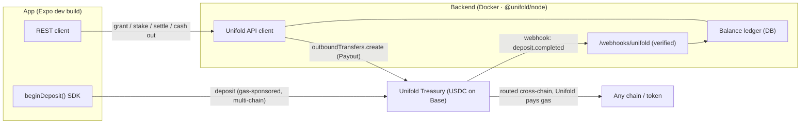

# Unifold Bank

A social "commitment bank" built on **Unifold**: you get a stablecoin balance, stake it to RSVP to hangouts, and if you flake, your stake is split among the friends who showed up. Money flows **in through Unifold's Deposit SDK** and **out through Unifold Payout**, cross-chain and gas-sponsored.

> For the pitch / judging narrative, see **[STORY.md](./STORY.md)**. For the exact API contract + constants, see **[CONSTANTS.md](./CONSTANTS.md)**.

---

## How it works

Money is **custodied in a single Unifold treasury**. Each user's balance is a claim against that reserve, tracked in the backend DB. Deposits and payouts touch the chain; **everything in between (grants, stakes, flake-tax settlement) is internal ledger** — instant, no gas, no per-event transactions.



### Money model
- **Grant** — a monthly stablecoin allowance (4 USDC), idempotent per calendar month.
- **Adjust** — external-input credit/debit (e.g. a scheduler), **floored at $0 (no debt)**.
- **Stake** — RSVP debits your balance into an event; settlement redistributes flakers' stakes to attendees (+ optional holiday multiplier), with a runtime **conservation invariant**.
- **Net settlement** — balances accrue internally; you only cash out on-chain once you're owed **$20+** (batches transfers → fewer fees).

---

## Unifold surface used

| Product / feature | Where |
|---|---|
| **Deposit SDK** (`beginDeposit`) — multi-chain, **gas-sponsored**, connect-exchange, `showBalance`, curated methods, theming | app "Add funds" |
| **Treasury** — custody of the pooled reserve | backend |
| **Payout** (`treasury.outboundTransfers`) — cross-chain cash-out, gas paid by Unifold | app "Cash out" |
| **Verified webhooks** (`constructEvent`, HMAC) — deposit + payout events | `POST /webhooks/unifold` |
| **Deposit crediting** — `directExecutions` poll **+** webhook (mutually idempotent) | `/deposits/refresh` + webhook |
| **Live token catalog** (`/v1/tokens/supported_deposit_tokens`) — dynamic cash-out options | `GET /catalog` |
| **Programmatic webhook endpoint** (`webhookEndpoints.create`) | `npm run setup:webhook` |
| **Users** (`external_user_id`, auto-created) | throughout |

---

## Prerequisites

- **Node 20+** and **Docker**
- **Xcode / Android SDK** for an **Expo dev build** — the Unifold client SDK ships native modules, so **Expo Go will not work**
- A Unifold **`pk_live`** key (client Deposit SDK) and **`sk_live`** key (server), dashboard **Test Mode OFF**
- A Unifold **treasury account** (`ta_…`) funded with **USDC on Base** (see [FUNDING.md](./FUNDING.md))
- **No personal wallet, no ETH** required — Unifold custodies funds and sponsors deposit gas

---

## Setup

### 1. Backend
```bash
cd server
cp .env.example .env          # set UNIFOLD_SECRET_KEY (sk_live) + TREASURY_ACCOUNT_ID (ta_…)
docker compose up --build     # listens on http://localhost:8787
```

### 2. App (dev build — not Expo Go)
```bash
cd app
cp .env.example .env          # set EXPO_PUBLIC_UNIFOLD_PK (pk_live) + EXPO_PUBLIC_API_URL
npx expo install @unifold/connect-react-native @react-native-async-storage/async-storage \
  @stripe/stripe-react-native react-native-gesture-handler react-native-svg react-native-webview
npx expo run:ios             # or run:android — compiles the native modules
```
> On a physical device, set `EXPO_PUBLIC_API_URL` to your machine's LAN IP (e.g. `http://192.168.1.42:8787`), not `localhost`.

### 3. (Optional) Real-time webhooks
```bash
cloudflared tunnel --url http://localhost:8787          # public URL
cd server && WEBHOOK_URL=https://<tunnel>/webhooks/unifold npm run setup:webhook
# copy the printed whsec_… into server/.env as UNIFOLD_WEBHOOK_SECRET
```
Without this, deposit crediting falls back to the poll (`Refresh balance`).

---

## Scripts (server)

| Command | What |
|---|---|
| `npm run check` | **Free, read-only** preflight — verifies auth + treasury + on-chain USDC, moves nothing |
| `npm run setup:webhook` | Registers the webhook endpoint via the SDK, prints the signing secret |
| `npm test` | 40 tests — ledger, no-debt floor, settlement math + conservation, webhooks (real HMAC), deposit credit |
| `npm run typecheck` | `tsc --noEmit` |

Full endpoint contract: **[CONSTANTS.md](./CONSTANTS.md)**.

---

## Demo flow

1. Open the app → user auto-created.
2. **Add funds** → `beginDeposit` opens (deposit from any chain / card / **Coinbase**, gas-sponsored) → funds route to the treasury → **Refresh balance** (or a webhook) credits it.
3. **Hangouts** → create an event with a stake → RSVP (stakes from your balance) → check in → **Settle** (flakers' stakes pay the friends who showed).
4. **Cash out** → pick a **chain/token** (fetched live from Unifold's catalog) + any address → poll `pending → processing → completed`.

---

## Honest status

- **Verified offline:** all backend logic — 40 passing tests, `tsc` clean, compiled against the real `@unifold/node` types (incl. webhook + `webhookEndpoints.create`).
- **Verify live:** the actual Unifold calls (deposit settle, cash-out settle, catalog shape) have not been executed here — a real run (e.g. a Coinbase deposit + one cash-out) proves them. `npm run check` de-risks the setup for free.
- **App:** SDK-side code is per Unifold's RN docs but not yet compiled — build with `npx expo run:ios` early.
- **Roadmap:** Checkout / Payment Intents (pay your exact stake) is web-only today — a natural next step via a web companion.

## Security
- `sk_live` and the webhook secret are **server-only** (`server/.env`); the app only holds the `pk_live` publishable key.
- Never commit `.env` (gitignored). The treasury is a custodial reserve — keep it funded to cover outstanding balances.
